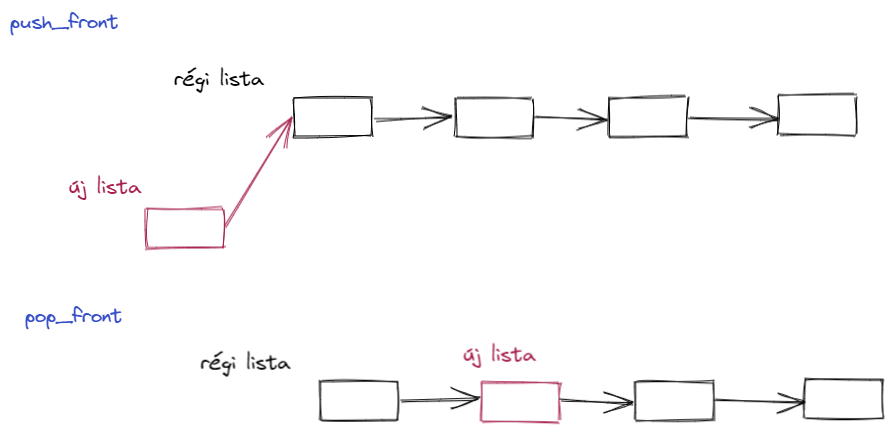

# Házi feladat II.: Perzisztens lista

Kövesse az alábbi utasításokat a perzisztens lista implementálása során!

##### 0.
A T típusú elemeket tartalmazó perzisztens lista vagy üres, vagy egy T típusú elemet tartalmaz, amelyet egy T-k perzisztens listája követ:

```
template<typename T>class List {
    private:
    public:
        List();
        List(T val, List tail);
        bool empty() const;
};
```

##### 1.
A perzisztens lista nem változik. Ez garantálja, hogy a `List` második konstruktorában szereplő `tail` paraméter állandó. Épp ezért elég egy pointer tárolni rá. Egy perzisztens lista vagy mindig üres (és az is marad), vagy nem üres. Egészítsük ki a kódot ezeknek az elvárásoknak megfelelően, rögötön gondolva arra, hogy a memória menedzselésére `shared_ptr`-ket használjunk:
```
private:

    struct Item {
        T val;
        std::shared_ptr<const Item> next;
        Item(T v, const std::shared_ptr<const Item> &tail) : val{ std::move(v) }, next{ tail } {}
    };

    std::shared_ptr<const Item> head;

public:

    List(T val, List tail) : head{ std::make_shared<Item>(std::move(val), tail.head) } {}
```

##### 2.
Írja meg a perzisztens lista alapértelmezett konstruktorát, illetve a `empty` metódust is.

##### 3.
A `front` metódus visszaadja a lista első elemét, miközben maga a lista nem változik. Üres listának nem szabad elkérni az első elemét, az ilyen logikai hiba okozzon assert-et! Írja meg a `front` metódust.

##### 4.
A `front` metódussal ellentében a `pop_front` metódus kiveszi a lista első elemét... Azaz, mivel a lista nem módosulhat, ezért egy olyan listát ad vissza, amely az eredeti lista 2. eleménél kezdődik (lásd ábra). Az eredeti lista nem változik. Egítse ki az alábbi `pop_front` metódust, illetve írja meg az abban használt (privát) konstruktort is!
```
... pop_front() ...
    ...
    return List{ head->next };
}
```

##### 5.
A `pop_front` metódus párja a `push_front`, de míg az előző "eltávolítja" a lista első elemét, addig az utóbbi egy új elemet fűz az elejére. Természetesen ez a metódus is egy új listát ad vissza, amelynek az első eleme az új elem, míg az az eredeti lista követi (lásd ábra). Implementálja ezt a metódust is!



##### 6.
Ha eddig még nem tette meg, akkor, a konstruktorokat leszámítva, tegye az összes metódust `const`-tá, hisz egyik sem módosít a listán.

##### 7.
Teszteljük az elkészült implementációt.

```
int main() {

    auto l1 = List<int>{}.push_front(12).push_front(13).push_front(14);

    std::cout << "The list is " << (l1.empty() ? "empty" : "not empty") << ".\n";
    print(l1);

    auto l2 = fmap<int>([](int i) { return 2 * i; }, l1);
    print(l2);

    auto l3 = filter(l1, [](int i) { return i % 2 == 0; });
    print(l3);
}
```
Ehhez azonban szükség van még pár segédfüggvényre...

##### 8.
Implementálja az `fmap` függvényt, a paramétereként megadott F függvényt alkalmazza a perzisztens lista midnen elemére, majd visszaad egy új listát, amelyben a F alkalmazásának az eredméynei vannak. Folytassa a függvény implementációját, használjon rekurziót!
```
template<typename T, typename F>
auto fmap(F f, List<T> lst) {
    static_assert(std::is_invocable<F, T>::value, "Cannot call F with T.");

    using R = typename std::invoke_result<F, T>::type;

    if (lst.empty())
        return List<R>{};
    
    ...
}
```

##### 9.
Szeretnénk egy adott predikátumnak megfelelő elemeket kiszűrni a listából. Írja meg a `filter` függvényt, amely egy predikátumot és egy perzisztens litát vár parméterként, visszatérési értéke pedig egy olyan lista, amely cska azokat az elemekt tartalmazza, amelyekre teljesül a megadott predikátum. Egészítse ki az alább megkezdett implementációt a három ponttal jelölt helyeken.
```
template<typename T, class P>
auto filter(List<T> lst, P p) {

    ...

    if (p(lst.front()))
        return ...
    else
        return filter(lst.pop_front(), std::move(p));
}
```

##### 10.
Jó lenne, ha meg lehetne hívni egy függvényt a lista minden egyes elemére. Implementálja a `for_each` függvényt, amelymeghív egy függvényt a perzisztens lista midnen elemére:
```
template<typename T, class F>
void for_each(List<T> lst, F f) {
    ...
}
```

##### 11.
Implementálja a `print` függvényt a perzisztens litához, amely `(e1) (e2) (e3) ... (en)` formátumban kiírja a lista elemeit a standard kimenetre. Használja az előbb megírt `for_each` függvényt!

##### 12.
A lista elemeinek feldolgozásához hasznos segédezköz a fold. Írja meg mind a `foldr` mind pedig a `foldl` függvényeket. Kövesse a mintaként megadott vázat. Figyeljen, hogy a lista ürességének a vizsgálata után csak egy `return` parancsot tartalmazzon a végleges kódja! 
```
template<typename T, typename A, typename F>
A foldr(F f, A acc, List<T> lst) {
    if (lst.empty())
        return acc;
    return ...
}
```
