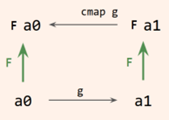

## 1. Feladat

Adja meg azt a `w` függvényt λ-kalkulusban, amely egy Fahrenheitben megadott `T` hőmérséklet esetén `T>90`-et, míg egy
Celsiusban megadott `T` hőmérséklet esetében a `T>30` kifejezést eredményezi, azaz:
```
w (Fahrenheit T) = T>90
```
és
```
w (Celsius T) = T>30
```

### Megoldás

```
Fahrenheit ≡ λtcf.ft
Celsius    ≡ λtcf.ct
w          ≡ λt.t(λf.f>90)(λc.c>30)
```

## 2. Feladat
Egyszerű alakzatokból, illetve azok uniójából és metszetéből rajzoljon hóembert. Maga a kép legyen egy (tag)függvény, amely
egy `(x, y)` koordinátára megadja, hogy azt milyen színűre (`int` érték) kell festeni. A kép készüljön el fordítási időben,
s legyen egy megfelelő méretű (`constexpr`) `std::array`-ben tárolva. 

### Megoldás

Lásd Snowman könyvtár.

## 3. Feladat
Legyen `C` és `D` két kategória. Legyen `F` egy leképezés, amely a `C` kategória objektumait és morfizmusait úgy képezi le a
`D` kategóriára, hogy közben megfordítja a nyilak irányát. Az ilyen leképezést kontravariáns funktornak nevezzük (lásd ábra).



* A típusok kategóriájában adjon példát kontravariáns funktorra! 
* Bizonyítsa be, hogy az Ön által alkotott funktor tényleg funktor!
* Mutassa be az Ön által megalkodott kontravariáns funktor működését!

### Megoldás

* Predikátumok (`T -> Bool` függvények).
* Legyen a két típusunk pl. a `Real` és a `Nat`, a közöttük levő morfizmus pedig a `round`. Ekkor egy `Nat -> Bool` függvényből 
  úgy készítünk egy `Real -> Bool` függvényt, hogy a valós bemenetre előbb alkalmazzuk a `round`-ot...
